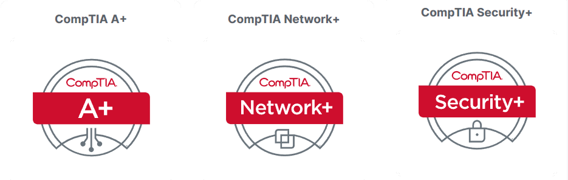

<!-- <h3 style="color:DodgerBlue;" align="center" >ALOHA🍁</h3> -->
<!--

 <b>I'm Dr_Wolf a guy who's into A.I and Cybersecurity always passionate for learning</b>

-->

 

 
 

 
- 📝 **I’m currently learning** :

and  _**CAPT (Certified Associate Penetration Tester)**_ 

 

 

- ⚒️ **Languages-Frameworks-Tools i Use**:
 

    

 

- 🤔 I’m looking for help with : 

 

- 📫 How to reach me: 👇
- 💬 You can ask me anything in Discord : 
https://discordapp.com/users/306169452293259265

<!--

-->
